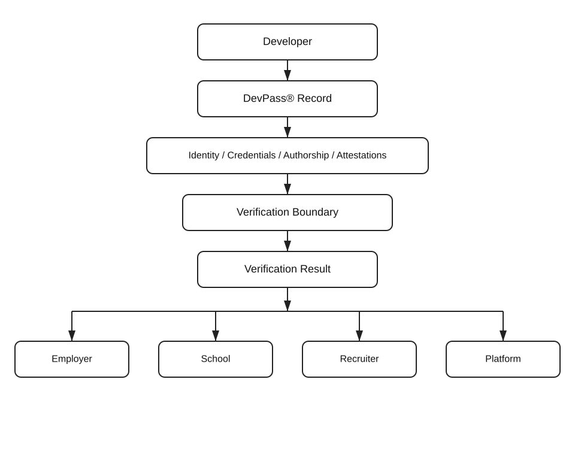

# DevPass® Reference Architecture

## Purpose

This document describes the public integration architecture for the DevPass® Integration Reference repository.

It is intentionally high-level and non-normative.

It does not disclose the complete DevPass® platform, proprietary identity-binding mechanisms, verification methods, anti-fraud controls, scoring logic, clearance workflows, biometric processes, or patent-sensitive implementation details.

## Architectural Principle

DevPass® separates:

* the developer record;
* supporting evidence and attestations;
* the verification boundary;
* the resulting verification output; and
* the external system that consumes that output.

The public architecture exposes integration structures without exposing the proprietary mechanisms used to establish or evaluate trust.

## Reference Flow

Developer
   │
   ▼
DevPass® Record
   │
   ├── Identity References
   ├── Skills / Credentials
   ├── Authorship Evidence
   └── Third-Party Attestations
   │
   ▼
Verification Boundary
   │
   ▼
Verification Result
   │
   ▼
External Consumer
   │
   ├── Employer
   ├── School
   ├── Recruiter
   └── Platform

## Developer Record

A DevPass® developer record may contain or reference structured information relating to:

* identity;
* credentials;
* skills;
* authorship;
* verified work;
* third-party attestations;
* educational evidence;
* employment evidence; and
* other implementation-defined professional trust information.

The public reference schema is intentionally limited.

It does not define the complete production DevPass® record model.

## Evidence and Attestations

A DevPass® record may reference evidence or attestations supplied by external parties.

Potential sources may include:

* employers;
* educational institutions;
* credential issuers;
* approved reviewers;
* developer platforms;
* training providers; and
* other trusted sources.

The presence of an attestation does not itself describe how DevPass® determines trust, weight, validity, or final verification status.

## Verification Boundary

The verification boundary represents the proprietary processing layer that evaluates record information and relevant evidence.

Public interfaces may expose the inputs and resulting outputs of this boundary.

Internal mechanisms may include separately maintained processes relating to:

* identity binding;
* evidence validation;
* authorship verification;
* credential verification;
* fraud detection;
* risk evaluation;
* clearance logic;
* reviewer or verifier workflows;
* challenge or defense procedures; and
* other implementation-specific controls.

These mechanisms remain outside this repository unless expressly approved for public release.

## Verification Result

A verification result provides a machine-readable output that may be consumed by an external system.

A public reference result may identify:

* the verification request or record;
* the resulting status;
* relevant evidence or attestation references;
* timestamps;
* verification-context references;
* provenance or integrity references; and
* implementation-specific metadata.

The public result format does not disclose the proprietary methodology used to produce the result.

## External Consumers

Potential consumers may include:

* employers;
* recruiters;
* educational institutions;
* developer platforms;
* credential systems;
* workforce marketplaces;
* enterprise systems; and
* other authorized applications.

External systems may use a verification result according to their own business, employment, admissions, credentialing, or workflow requirements.

## Relationship to CREDA®

DevPass® is a product within the CREDA Systems portfolio.

DevPass® may use CREDA® infrastructure for governance, integration, validation, or related technical functions.

Publication of DevPass® reference interfaces does not disclose or license the proprietary CREDA® runtime or separately maintained implementation technology.

## Relationship to VTI Foundation Inc.

VTI Foundation Inc. develops and stewards standards, reference architectures, and governance frameworks separately from CREDA Systems.

This public DevPass® architecture does not define VTI Foundation Inc. conformance, certification, verification, or conformity-assessment requirements.

## Public / Private Boundary

This repository may expose:

* record structures;
* attestation formats;
* verification-result interfaces;
* examples;
* integration patterns;
* implementation-neutral documentation; and
* public integration code where appropriate.

It does not, by default, expose:

* proprietary identity-binding mechanisms;
* biometric verification methods;
* scoring or ranking logic;
* fraud-detection models;
* clearance decisioning;
* reviewer trust weighting;
* live-defense procedures;
* anti-gaming controls;
* internal service architecture; or
* unpublished patent-sensitive implementation details.

## Non-Normative Status

This architecture is a public reference model only.

It does not constitute a complete DevPass® production implementation or create rights beyond those expressly provided by the repository license.

See `../NOTICE.md` for additional intellectual-property and platform-boundary information.
